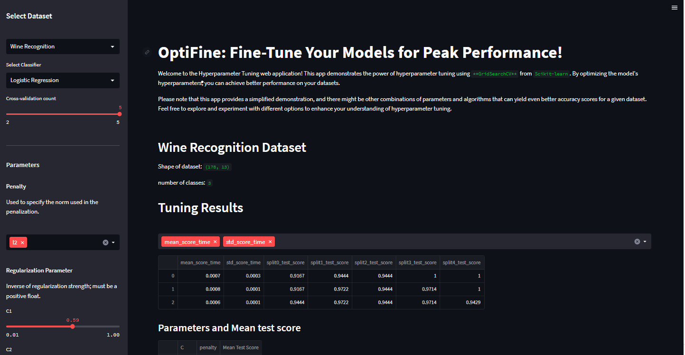
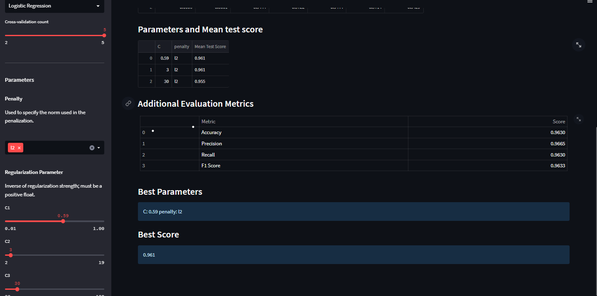

# OptiFine: Fine-Tune Your Models for Peak Performance!

Welcome to OptiFine, a web application that demonstrates the power of hyperparameter tuning using Scikit-learn's GridSearchCV. OptiFine allows you to optimize your machine learning models by fine-tuning their hyperparameters to achieve peak performance.





## Features

- Select from two datasets: Iris Plants and Wine Recognition.
- Choose from three classifier algorithms: Random Forest, SVM, and Logistic Regression.
- Customize the number of cross-validation folds.
- View dataset information, such as the number of samples, features, and classes.
- Perform hyperparameter tuning using GridSearchCV.
- Display the best parameters and evaluation metrics, including accuracy, precision, recall, and F1-score.

  
## Usage

1. Clone the repository:
```bash
git clone https://github.com/MahtabRanjbar/OptiFine-ml-app.git
```

2. Install the required dependencies:

  ```bash
  pip install -r requirements.txt
  ```

3. Run the application:
```bash
streamlit run app.py
```

4. Access the application in your web browser at `http://localhost:8501`.


## License

This project is licensed under the [MIT License](LICENSE).